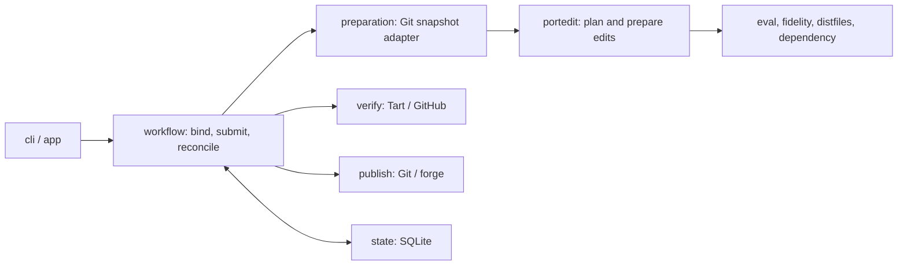

# Review: bump workflow architecture

Date: 2026-09-17. This review examines the working tree at `c828b35`, including
the then-uncommitted changes in `portedit/profiles_test.go` and
`portedit/unmodeled.go`. It follows the main bump workflow through preparation,
verification, and publication. These are architectural observations and proposed
directions for triage; recording them does not add them to the accepted roadmap
or mean that the changes have been implemented.

The core architecture is sound. The highest-value improvements are clearer domain
objects and ownership boundaries. The remaining friction comes from concepts
spread across request fields, mutable intermediate state, and conventions between
callers.

The main structure is:



Several boundaries deserve preservation:

- Change, revision, job, attempt, and submission are distinct concepts. Those
  distinctions support retries and recovery without confusing a contribution
  with one execution.
- Workflow owns durable progress; providers own external execution. The claim,
  external operation, and revalidate-and-record sequence is appropriate.
- Evaluation, source editing, and fidelity checks are separate. Native
  observations supply evidence; editing policy decides what that evidence
  permits.
- Preparation produces immutable source before branch integration. The release
  and candidate checkpoints are valuable recovery boundaries.

The existing `Lease`, typed `outcome`, `workflow/policy`, and
`macports/fidelity` extractions are good examples of concepts that simplify the
implementation. Several recommendations in the
[September 16 structural review](2026-09-16-bump-machinery-structure.md) have
already been implemented and should be treated as strengths of the current tree.

## 1. Represent the resolved bump selection explicitly

A bump now has several identities: the port the user named, the owning Portfile,
the subport carrying the editable release, the owner of discovery metadata, and
the targets to verify.

Stub handling makes the missing abstraction visible:

- [`workflow.BindPreparation`](../../internal/workflow/preparation_bind.go)
  redirects a stub selection to its newest versioned subport.
- [`portedit.Service.load`](../../internal/macports/portedit/source.go) also
  redirects the selection and borrows the stub's livecheck metadata.
- [`preparationRequest`](../../internal/workflow/preparation_run.go) deliberately
  selects the stub again so that this behavior happens again during preparation.

Introduce a small `BumpSelection` value that records these roles explicitly.
MacPorts-specific resolution would produce it, workflow would persist the
relevant identities, and preparation would consume or validate that binding.

This would remove much of the special treatment of `Stub`, `CommitName`, and
`Targets[0]`. It would also give future selection rules one clear home. The
requested scope policy should remain separate from the actual affected scope
discovered during planning: selecting a shared release and establishing exactly
which declarations it changes are different operations.

## 2. Finish making preparation a session, plan, and prepared result operation

The foundations already exist: `VersionProbe`, `workspace`, `archivePlan`, and
`observedArchivePlan`. The issue is how they fit together.

[`sourceInput`](../../internal/macports/portedit/source.go) combines baseline
facts, workspace access, caches, and candidate-derived fields. Version evaluation
in [`version_edit.go`](../../internal/macports/portedit/version_edit.go) writes
the selected version input back into that object. Archive planning in
[`version.go`](../../internal/macports/portedit/version.go) carries a partially
populated final `Result`.

Consequently, callers need to know which earlier operation populated which
fields. The clearest example is obtaining the authoritative final snapshot from
the last diagnostic report: both
[`prepareDependencyVersion`](../../internal/macports/portedit/dependencies.go)
and the [Git adapter](../../internal/workflow/preparation/preparation.go) use
`Fidelity[len(Fidelity)-1].After`.

Distinguish three responsibilities:

- **Session:** bound baseline, disposable workspace, evaluation operations, and
  caches.
- **Plan:** selected version input, candidate contents, affected and protected
  declarations, contexts, archive requirements, and dependency work.
- **Prepared edit:** final files, an explicit final snapshot, and diagnostics.

`assess` already shares archive planning with bump. Extending that shared plan to
describe dependency work would reduce the parallel orchestration in
[`assessment.go`](../../internal/macports/portedit/assessment.go) and
[`dependencies.go`](../../internal/macports/portedit/dependencies.go). Assessment
could report the plan's established facts and unperformed stages, while execution
fulfils its archive and helper requirements.

This can remain internal initially. Sessions should remain disposable. Preserve
the durable release checkpoint and final revalidation, including the upstream
checks around preparation and evaluation of the stored Git candidate. A clearer
plan should make those boundaries easier to see.

## 3. Give platform and context analysis its own responsibility boundary

[`profiles.go`](../../internal/macports/portedit/profiles.go),
[`unmodeled.go`](../../internal/macports/portedit/unmodeled.go), and
[`platform_observations.go`](../../internal/macports/portedit/platform_observations.go)
collectively form a substantial analysis subsystem. They understand Tcl control
structures, variable propagation, platform boundaries, host inputs, and which
uses can affect source declarations.

Isolate this behind a context analyzer that returns profiles, required
observations, and explicit coverage gaps. A package such as
`macports/contextmodel` could eventually own it; a dedicated type within
`portedit` would be a reasonable first step.

The useful division is:

- `eval` reports what executed and what it observed.
- Context analysis determines what those observations can establish.
- `portedit` decides whether the proposed edit satisfies its requirements.

Changes to these rules affect confidence in an edit. Giving them a compact API
makes their assumptions easier to inspect and test. Keep the MacPorts-specific
rules here rather than moving them into the generic Tcl syntax package. Native
evaluation and modeled metadata must continue to have distinct meanings; modeled
coverage does not establish that a build ran on another platform.

## 4. Separate contribution presentation from workflow execution first

`workflow` currently contains roughly 6.5k lines of production Go across intake,
reconciliation, contribution lifecycle, retention, and presentation. Its size
alone is not the problem, but these responsibilities have different reasons to
change.

The cleanest extraction is
[`contribution_view.go`](../../internal/workflow/contribution_view.go). It groups
history, chooses display wording, describes macOS versions, and generates
suggested CLI commands. That is a shared presentation model, already consumed by
both CLI and TUI.

Move it into something like `internal/contributionview`, preserving one projection
for all interfaces. Workflow would expose recorded status; presentation would
explain it. This should preserve the existing consistency between plain output,
JSON, and the live table.

Afterward, consider separate intake and driver objects within `workflow`.
[`Engine`](../../internal/workflow/engine.go) currently exposes dependencies for
both. Smaller objects would make required capabilities clearer without requiring
an immediate package split.

Retain explicit phase implementations. Preparation, verification, and publication
have materially different recovery rules. Their shared vocabulary for leases,
outcomes, and uncertainty is useful; a generic phase runner would need to justify
its additional indirection against those differences.

## 5. Make the preparation adapter's contract independent of the editor's contract

The responsibility of `workflow/preparation` is sensible, but its public boundary
is blurred by the
[`Request = portedit.Request` alias](../../internal/workflow/preparation/preparation.go).

That exposes `Root` to workflow callers even though the adapter creates the
workspace itself. It also carries commit naming and message concerns down into
the editor.

Give the adapter its own request type containing immutable source, resolved
selection, release, and preparation options. The editor would receive a
workspace-bound session. Commit-message construction would live with contribution
preparation, using the editor's semantic result.

There is also an inexpensive simplification here: workflow requires exactly one
commit, while the result exposes `[]CommitIntent`. A singular commit intent would
express the current invariant directly.

Keep [`normalizeSpec`](../../internal/workflow/request.go) as the central
acceptance gate. It owns useful cross-checks between action, destination, and
verification policy. Clarifying the adapter's types does not require distributing
those cross-checks among several per-action validators.

## 6. Keep release facts separate from verification coverage policy

[`ReleaseScope`](../../internal/record/release_scope.go) is a useful record of
affected and protected members. Its `RequiredTargets` method, however, takes an
entire `JobSpec` and decides whether verification requires the initiating target
or every buildable member.

That is execution policy embedded in a shared record type. Move the decision into
`verify`, with explicit coverage intent as input, and use the existing
`VerificationPlan` as the concrete result. Publication policy should consume the
same decision.

What the bump changes and what the requested verification must cover are different
sets. The code recognizes this already; the ownership can make it clearer. Keep
the actual affected and protected membership in `ReleaseScope` and avoid creating
a second competing representation of the existing verification plan.

## Suggested sequence and validation

Start with the resolved selection, the explicit final prepared result, and the
contribution-view extraction. Those offer concrete simplification with limited
disruption. The broader plan/session refinement can then proceed incrementally.

The review ran these focused suites successfully:

```sh
go test ./internal/macports/portedit ./internal/workflow/preparation ./internal/verify ./internal/workflow
```

The first attempt encountered the execution sandbox's restriction on binding
loopback ports for local HTTP fixtures. The rerun with local test-server access
passed all four packages. Existing tests cover useful boundaries including frozen
release selection, restart recovery, and publication after verification.

This was a code and test review. No real VM build or publication was performed,
and the review made no implementation changes.
