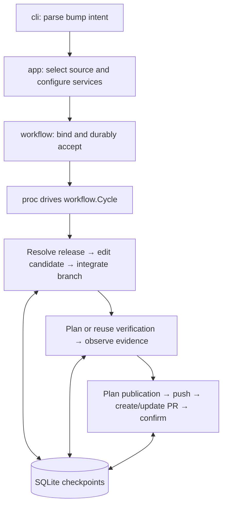

# Architecture and organization review — 2026-09-22

Reviewed commit: `0f201ebdf477ef1bbf47d8b01213cba1a3f999f4`.

**Dockhand has a sound architectural foundation, but `workflow` has become the central concentration of responsibilities. The most urgent problem is the split ownership of preparation between `app` and `workflow`, which is already causing behavior to diverge.** `portedit` is the next package to watch closely.

This review used a separate snapshot of the reviewed commit, excluding the checkout's uncommitted changes. The binary was built, and its root, bump, verify, and publish help was inspected. Documentation in `docs` and tests were excluded from the architectural analysis. Source links below identify the reviewed commit. No implementation changes were made, and tests were not run.

Dockhand's code reflects a substantial intention: maintain a contribution throughout its life, including interruption, retries, manual amendments, verification, publication, and eventual cleanup. That explains much of its complexity. Its core concepts—immutable source, contribution, revision, job, attempt, evidence, and publication action—are useful distinctions.

The fresh bump path is reasonably coherent:

Preparation delegates Portfile interpretation and transformation to `portedit`; verification delegates execution to Tart or GitHub; publication delegates destination selection, metadata, and forge calls to `publish`. GitHub verification can itself push the branch before the publication phase.

The trouble is that these boundaries become less consistent around continuation, correction, and lifecycle management.

**1. Give all preparation paths one owner. This is the first recommended change.**

A fresh bump resolves its release and prepares its candidate inside the durable workflow. An update onto an adopted or subsequently amended contribution instead runs through [`app.prepareOnto`](https://github.com/herbygillot/dockhand/blob/0f201ebdf477ef1bbf47d8b01213cba1a3f999f4/internal/app/preparation.go#L147). That function resolves the release and performs the edit synchronously, before job submission, then translates the result into an amendment.

This creates two implementations of the same user operation with different persistence and information flow.

There is concrete evidence of divergence:

- `prepareOnto` passes `result.PreparedTree` into `CorrectionRequest`, but does not carry the preparation's patch findings. The correction fast path constructs a `PreparedChange` without them. Consequently, the patch gate in branch integration has no findings to act on.
- `app.Preparation.AllSubports` reaches the fresh preparation request, but the `prepareOnto` conversion drops it; `CorrectionRequest` has no corresponding field.
- Release resolution and expensive preparation on this path occur before durable acceptance, so they do not benefit from the fresh path's release checkpoint and preparation lease.

Compare the [conversion to correction](https://github.com/herbygillot/dockhand/blob/0f201ebdf477ef1bbf47d8b01213cba1a3f999f4/internal/app/preparation.go#L188), [candidate construction](https://github.com/herbygillot/dockhand/blob/0f201ebdf477ef1bbf47d8b01213cba1a3f999f4/internal/workflow/preparation_run.go#L158), and [patch gate](https://github.com/herbygillot/dockhand/blob/0f201ebdf477ef1bbf47d8b01213cba1a3f999f4/internal/workflow/preparation_integrate.go#L128). These are static findings from the code path, not reproduced execution failures.

Introduce a common **preparation intent and prepared candidate contract**. The intent would identify the source, edit, destination, and verification choices. The candidate would carry the resulting tree, release, scope, patch findings, and commit intent. Creating or replacing a contribution branch would be a separate integration choice.

Fresh preparation and preparation onto an existing contribution should pass through the same durable stages. Preview should invoke the same planning/editing service through a preview entry point.

The existing [`workflow/preparation.Service`](https://github.com/herbygillot/dockhand/blob/0f201ebdf477ef1bbf47d8b01213cba1a3f999f4/internal/workflow/preparation/preparation.go#L57) is a useful starting point, but its request is currently an alias of `portedit.Request`. It needs a contract that describes the complete preparation operation independently of the editor.

**2. `workflow.Engine` is already a monolithic coordinator, despite the small individual files.**

Some scale measurements help locate the pressure:

| Package | Production Go lines¹ | Files | Assessment |
|---|---:|---:|---|
| `workflow` | 7,171 | 47 | Main responsibility concentration |
| `cli` | 3,677 | 25 | Large, mostly explained by command surface |
| `macports/portedit` | 3,009 | 20 | Cohesive purpose, increasingly entangled implementation |
| `state/sqlite` | 2,501 | 14 | Persistence plus some workflow semantics |
| `macports/portindex` | 1,897 | 9 | Several concerns, but a recognizable boundary |
| `app` | 1,692 | 21 | Composition mixed with use-case decisions |

¹Including comments and blank lines; excluding tests and child packages.

[`Engine`](https://github.com/herbygillot/dockhand/blob/0f201ebdf477ef1bbf47d8b01213cba1a3f999f4/internal/workflow/engine.go#L51) owns request binding, acceptance, scheduling, preparation, correction, verification, publication, contribution adoption, PR synchronization, branch cleanup, retention, and status queries. Its package contains 165 functions.

The file organization makes these responsibilities discoverable, but they still share one unrestricted package and one dependency container. A new feature can conveniently become another `Engine` method with access to everything.

Establish these owners, initially as smaller services and then packages where the dependencies permit:

| Owner | Responsibility |
|---|---|
| `contribution` | Selection, adoption, revisions, correction preconditions, reassociation, PR lifecycle |
| `workflow` | Durable acceptance, claims, scheduling, phase advancement |
| `maintenance` | Resource retention, diagnostic pruning, cleanup sweeps |
| Existing `workflow/view` | Status projection and presentation vocabulary |

Branch cleanup provides a concrete reason for the separation: [`deleteLocalBranch`](https://github.com/herbygillot/dockhand/blob/0f201ebdf477ef1bbf47d8b01213cba1a3f999f4/internal/workflow/contribution_branches.go#L161) and [`collectMergedBranches`](https://github.com/herbygillot/dockhand/blob/0f201ebdf477ef1bbf47d8b01213cba1a3f999f4/internal/workflow/retention_branches.go#L17) separately implement decisions about checked-out branches, expected commits, deletion, and recording the outcome. Periodic synchronization and explicit GC should use one cleanup operation.

Each extracted owner should receive its actual dependencies. Passing `*workflow.Engine` into the new packages would preserve the coupling under different directory names. Cross-record invariants should retain their existing atomic transaction boundaries.

**3. The boundary between external work and database transactions needs enforcement.**

Much of the driver follows a good protocol:

1. Claim work in a transaction.
2. Perform the external operation.
3. Revalidate the claim and record the result.

However, [`Submit`](https://github.com/herbygillot/dockhand/blob/0f201ebdf477ef1bbf47d8b01213cba1a3f999f4/internal/workflow/submit.go#L120), [preparation integration](https://github.com/herbygillot/dockhand/blob/0f201ebdf477ef1bbf47d8b01213cba1a3f999f4/internal/workflow/preparation_integrate.go#L88), and [reassociation](https://github.com/herbygillot/dockhand/blob/0f201ebdf477ef1bbf47d8b01213cba1a3f999f4/internal/workflow/reassociate.go#L90) call `sharedFiles` inside write transactions.

That apparently small helper invokes Git diff and potentially tree-wide Git searches through [`changeset.SharedUsers`](https://github.com/herbygillot/dockhand/blob/0f201ebdf477ef1bbf47d8b01213cba1a3f999f4/internal/git/changeset/shared.go#L21). SQLite write transactions use [`BEGIN IMMEDIATE`](https://github.com/herbygillot/dockhand/blob/0f201ebdf477ef1bbf47d8b01213cba1a3f999f4/internal/state/sqlite/transaction.go#L52).

The practical consequence is that collecting optional descriptive metadata can hold the shared database writer while subprocesses run, delaying unrelated jobs and repositories.

Compute this metadata outside the transaction against the immutable source, then validate the expected revision and store the result inside it. A small `RevisionMetadata` value would make that handoff explicit.

More broadly, transaction helpers should operate on state and supplied observations. Helpers capable of subprocess, network, or filesystem work should be visibly outside that boundary. This would make the existing recovery design easier to preserve as features accumulate.

**4. `portedit` needs a few stronger objects before it needs many more packages.**

The editor already has valuable separations: Tcl syntax, Portfile edits, evaluated fidelity, archive transport, modeled observation, and dependency generation. Those boundaries are doing useful work.

The concentration is around [`sourceInput`](https://github.com/herbygillot/dockhand/blob/0f201ebdf477ef1bbf47d8b01213cba1a3f999f4/internal/macports/portedit/source.go#L26). It holds:

- Workspace and overlay lifetime.
- Interpreter lifetime.
- Selected and owning targets.
- Original and substituted baseline contents.
- Lazily evaluated family metadata.
- Observation configuration.
- Mutable version-input and release-scope findings.

Nearly every editing operation depends on this object. In [`dependencyBase`](https://github.com/herbygillot/dockhand/blob/0f201ebdf477ef1bbf47d8b01213cba1a3f999f4/internal/macports/portedit/dependencies.go#L123), a shallow copy becomes another logical input, with selected fields replaced while other resources remain shared. The comments explain this carefully, but maintaining it requires understanding which fields are values, caches, borrowed state, and owned resources.

Separate three concepts:

- **Evaluation session:** owns interpreters and temporary projections.
- **Edit baseline/candidate:** carries contents, target, and evaluated metadata.
- **Archive coverage plan:** records declarations, archive ownership, context coverage, and protection constraints.

The third has particularly clear reuse potential. [`planObservedArchives`](https://github.com/herbygillot/dockhand/blob/0f201ebdf477ef1bbf47d8b01213cba1a3f999f4/internal/macports/portedit/artifact_plan.go#L50), [`planObservedChecksums`](https://github.com/herbygillot/dockhand/blob/0f201ebdf477ef1bbf47d8b01213cba1a3f999f4/internal/macports/portedit/checksums.go#L34), and [`assessArchives`](https://github.com/herbygillot/dockhand/blob/0f201ebdf477ef1bbf47d8b01213cba1a3f999f4/internal/macports/portedit/artifact_assess.go#L12) repeat the process of observing contexts, associating checksum groups with artifacts, tracking declared/covered/inert groups, and checking coverage.

Their acceptance policies differ and should remain explicit. The common observation and coverage model could still be shared.

Start with these objects inside `portedit`. Extract a package once its input and result types are clear; otherwise the extraction will require exporting much of `sourceInput`, spreading the coupling.

**5. Workspace materialization has a hidden dependency through root-path lookup.**

[`workspace`](https://github.com/herbygillot/dockhand/blob/0f201ebdf477ef1bbf47d8b01213cba1a3f999f4/internal/macports/workspace/workspace.go#L59) maintains a package-global map from root paths to live workspaces. `EnsurePortAt`, `WidenAt`, and `ScopeOf` recover objects from that map.

That lets code receiving a `macports.Tree` or root string secretly materialize more source. For example, [indexed selection](https://github.com/herbygillot/dockhand/blob/0f201ebdf477ef1bbf47d8b01213cba1a3f999f4/internal/macports/selection/selection.go#L63) resolves a name, then looks up the workspace globally to bring its files into existence.

This works, but the passed value does not express the capability the operation needs. Whether a root is registered changes its behavior; an unregistered root makes these operations no-ops or is treated as a complete materialization.

There is already an explicit, injected [`workspace.Registry`](https://github.com/herbygillot/dockhand/blob/0f201ebdf477ef1bbf47d8b01213cba1a3f999f4/internal/macports/workspace/registry.go#L18) for sharing and lifetime management. The global lookup is a second, implicit mechanism.

Pass a small projection/materialization interface alongside source identity: access to the root, ensuring a port, and ensuring the whole tree. A complete materialization can implement the ensure operations trivially. That makes sparse-source behavior part of the contract and allows the global lookup to disappear.

This is a boundary-quality issue more than a package-size issue.

**6. Separate scheduling from long-running operations as multi-job usage grows.**

[`Cycle`](https://github.com/herbygillot/dockhand/blob/0f201ebdf477ef1bbf47d8b01213cba1a3f999f4/internal/workflow/cycle.go#L91) processes due jobs sequentially. A handler can perform a complete release lookup, preparation, or provider admission before the next job is visited. The configured defaults allow [10 minutes for preparation and 15 minutes for provisioning](https://github.com/herbygillot/dockhand/blob/0f201ebdf477ef1bbf47d8b01213cba1a3f999f4/internal/workflow/timing.go#L18).

Therefore, one slow operation can delay unrelated build observations, publication, cleanup, and newly arriving control requests in the same driver. Multiple processes can make progress through the claim mechanism, but a single `serve` process still has this limitation.

This is a code-derived scheduling concern; it was not benchmarked.

Retain the claim protocol while introducing bounded operation execution: select and claim eligible work, execute a limited number of independent operations, then record results. Scheduling and observation should remain responsive while preparation is occupied.

Simply putting goroutines around the current loop would be unsafe: the `cycle` object contains mutable “current provider” fields. Per-operation provider bindings and execution context should come first. The existing `attemptAction`/`attemptResult` split offers a useful pattern.

**7. State handling needs clearer transition ownership, without discarding its defensive checks.**

There are two related pressures.

First, [`JobSpec`](https://github.com/herbygillot/dockhand/blob/0f201ebdf477ef1bbf47d8b01213cba1a3f999f4/internal/record/job.go#L52) carries choices for several different operations. Those choices are repeatedly transported through CLI options, application requests, workflow requests, accepted specifications, and SQLite's [`jobOptions`](https://github.com/herbygillot/dockhand/blob/0f201ebdf477ef1bbf47d8b01213cba1a3f999f4/internal/state/sqlite/records.go#L260). The dropped `AllSubports` choice is an example of the maintenance risk.

Small cohesive values for verification choices and publication intent would reduce repeated field copying. Operation-specific constructors could then produce the durable specification. The existing centralized normalization is useful and should remain.

Second, verification's [`execution`](https://github.com/herbygillot/dockhand/blob/0f201ebdf477ef1bbf47d8b01213cba1a3f999f4/internal/workflow/execution.go#L14) loads a job's attempts, submissions, and resources, shallow-copies them, mutates the copy, and discovers writes using `reflect.DeepEqual`. It also contains persistence-order knowledge, such as closing an old submission before inserting its replacement.

This is a compact unit-of-work mechanism, but change tracking and ownership are implicit. Nested pointers and slices require particular care because the clone is shallow. Every transition also loads the cohort, even when operating on one attempt.

Give the verification aggregate explicit transition methods and an explicit set of writes to apply. Cohort-wide evaluation can remain where completion requires it. That makes mutation, persistence ordering, and the necessary reads reviewable.

SQLite should retain referential integrity, immutability, and concurrency checks. Semantic transition decisions should have named owners so they do not gradually become a second workflow implementation inside `PutJob` and related methods.

Several existing boundaries deserve preservation:

- **Immutable source and revision identity.** This supports reliable continuation and evidence matching.
- **Attempt, submission, and resource separation.** These represent different recovery and lifetime concerns.
- **Provider reconciliation.** The [provider contract](https://github.com/herbygillot/dockhand/blob/0f201ebdf477ef1bbf47d8b01213cba1a3f999f4/internal/verify/provider.go#L99) explicitly handles uncertain admission; that complexity is justified.
- **Publication confirmation.** [`runPublication`](https://github.com/herbygillot/dockhand/blob/0f201ebdf477ef1bbf47d8b01213cba1a3f999f4/internal/workflow/publication_run.go#L168) distinguishes pushing, requesting a PR write, and observing the desired result. Preserve that protocol through any extraction.
- **Shared status projection.** [`workflow/view`](https://github.com/herbygillot/dockhand/blob/0f201ebdf477ef1bbf47d8b01213cba1a3f999f4/internal/workflow/view/contribution.go#L108) gives CLI, JSON, and TUI a common interpretation of recorded state.
- **Focused infrastructure packages.** Git operations, Tcl execution, forge adapters, and archive transport generally have recognizable purposes.

Leave `cli` largely intact for now: its size mostly follows the command and presentation surface. `app`'s broad import set is also expected for composition; the concern is the operational policy mixed into it. `record` has high reuse but no internal-package dependencies, so splitting it merely to reduce size would have little immediate value.

The recommended order is:

1. **Unify preparation and preserve the full candidate and verification intent across continuation.**
2. **Move Git metadata collection outside write transactions.**
3. **Extract contribution lifecycle and consolidate branch cleanup.**
4. **Make workspace materialization explicit and strengthen the editor's session/candidate/coverage objects.**
5. **Improve driver scheduling and verification change tracking as separate, carefully bounded refactors.**

The first refactor should make fresh bumps, continued bumps, and previews share the same preparation semantics. That would address an observable architectural weakness immediately and give the subsequent package splits a much clearer foundation.
