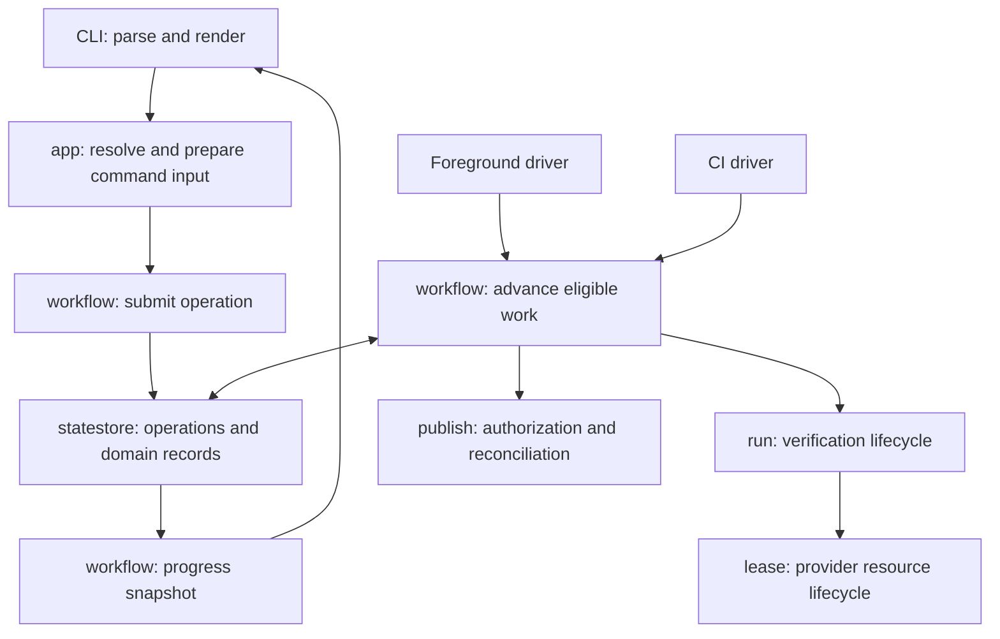

**Dockhand architecture migration — proposed implementation plan**

Prepared September 10, 2026 against commit `1710985`, following the synchronous bump-to-PR and asynchronous verification reviews. This is a plan; it does not enact the migration. Breaking internal APIs, command behavior, and persisted-state formats are permitted. The intended result is a smaller set of authoritative decisions that is straightforward to understand and change.

The companion [CLI proposal](/Users/herby/Source/project-dockhand/docs/cli-proposal.md) specifies the proposed commands and defaults, including `publish`, consistent attachment, and `ci --drain` replacing the public one-pass command. These are design proposals, not changes to the installed CLI.

**The architecture to implement**

Add one package, `internal/workflow`, to own coordination across change, verification, and publication. Keep the domain packages that already do those jobs. Commands submit durable requests and render their progress; foreground execution and dispatch advance those requests through the same coordinator.

Add one durable record, `record.Operation`, describing an accepted request. Move the requested destination out of `Change.Destination` into this record. A change describes the edited artifact and its history; an operation describes what someone requested for a particular revision of it. For example, verifying a branch and subsequently requesting its publication are separate requests against the same change.

An operation references attempts and a publication; it does not copy their phases, verdicts, logs, or lease state. Its progress is derived from those records. Keep explicit operation cancellation, supersession, or a refusal that cannot be derived elsewhere, but do not introduce a second verification state machine.

Both drivers use the same advancement loop. A foreground command advances eligible repository work while waiting for its operation; `dockhand ci` (the proposed replacement for `dockhand dispatch`) runs that loop continuously. Claims coordinate concurrent drivers. Driver presence is useful status information, but it does not decide which implementation may settle a build. A detached command submits and returns; an active CI driver is required for continued orchestration after all foreground drivers exit. Running guests can outlive either driver. Report this distinction explicitly when no driver remains.

This migration does not add automatic daemon startup. That can be a subsequent product decision with its own process-supervision behavior.

**Package ownership**

| Package | Responsibility after migration | Change |
| --- | --- | --- |
| `cli` | Parse options, wire dependencies, drive/wait, render, map outcomes to exit codes. | Remove lifecycle decisions and residency-based execution branches. |
| `app` | Resolve selectors, prepare edits, handle command-specific input. | Move coordination into `workflow`; retain useful preparation adapters. |
| `workflow` | Submit/join operations, coordinate domain transitions, schedule work, derive progress. | New package; concrete code for Dockhand's workflows. |
| `record` | Durable identities, specifications, operations, attempts, leases, publications. | New schema; split overloaded types and remove duplicated authoritative fields. |
| `run` | Admission, preflight, provider observation, judgment, settlement. | Keep the existing lifecycle; make entry points claim-aware and outcomes explicit. |
| `lease` | Acquisition, uncertain submission recovery, retention, release. | Couple admission to the attempt before submission; retain resource ownership here. |
| `publish` | Publication policy, desired/observed comparison, recoverable effects. | Extend the current journal and authorization implementation. |
| `staging`, `macports/port` | Materialize a snapshot and bind a complete target to an evaluator. | Strengthen existing types; no new generic source package. |
| `planning`, `change`, intent implementations | Plan edits and create/update change artifacts. | Consume pinned context; keep source-editing and fidelity logic. |
| `statestore` | Transactions and persistence. | Keep the Git-backed store; add the operation document and format boundary. |
| `report` | Format progress and evidence. | Consume a shared projection; remove its independent attempt-ranking decisions. |

Dependency direction is `cli -> app/workflow/report`, `app -> workflow/domain`, and `workflow -> domain/statestore`. Domain packages must not import `workflow` or `app`. `record` contains data without orchestration dependencies. `report` formats workflow snapshots without importing command implementations. Keep runtime evaluator/provider handles out of persisted types.

Use ordinary Go functions, structs, and small interfaces at I/O boundaries. A configurable workflow language, general job framework, event bus, or storage replacement is outside this migration. Extract a helper or interface when actual callers need it.

**Concepts and decisions**

1. **Operation: the accepted request.** Store its ID, change ID, pinned revision/content, requested goal, exact attempt bindings, request provenance, and publication request/authority when applicable. Goals are branch prepared, verification answered, and publication completed. An answered verification may have a negative verdict; reaching that milestone is distinct from passing. Completion of publication means the authorized head and managed PR content are observed. Operation progress includes a named refusal or blocked reason, so a waiter can return when a person must act.

2. **Verification specification: the immutable question.** Persist one complete specification and its digest. Include source/context identity, roster and dependency ordering, selected subports/variants, tests, baseline when it affects requested evidence, and the resolved environment identity relevant to verification. Resolve mutable image labels before fixing that identity. Keep observed guest details as evidence. Remove the independently supplied copies of content, platform, and test settings currently present across `Enqueue`, `Spec`, and `Ask`. Serialization and construction must have one authority for each value.

3. **Execution policy and observation options.** Retention and an explicit build deadline belong to execution policy. Waiting and log following belong to the observer. Joining a compatible active attempt can extend retention; it cannot silently shorten an existing deadline. Return a policy conflict if an incompatible join would change someone else's active execution. Provide explicit fresh verification, which creates a new attempt even when reusable evidence exists.

4. **Complete source context.** Identify the input tree snapshot, integration base, relative port directory, selected subport, variants, and evaluation frame. Pin relevant working-tree inputs when that is the command's selected source. Resolve the base once. Planning and preparation must agree on the source being checked and edited; any transplantation onto a different base must validate its preconditions. Staging materializes the tree before evaluation, including `_resources` and port-local files. Runtime handles bind that materialization to the correct evaluator. Start with no cross-operation evaluation cache; introduce reuse only with a complete key and an explicit account of ambient MacPorts/tool inputs.

5. **Repository scope and execution claims.** Use the canonical common Git directory as the local repository scope, with host identity where resource ownership requires it. Keep the submitting worktree path as provenance. Claims identify temporary responsibility for advancing work; they do not redefine which repository owns an attempt. All linked worktrees share scheduler coverage. Distinct clones retain distinct local scopes.

6. **Explicit attempt phases and effect recovery.** Use `Queued`, `Preparing`, `Submitting`, `Running`, and `Finished`, with the terminal verdict and deferral details stored separately. A lease retains its own lifecycle because its cleanup can outlive the attempt. Unknown external outcomes belong to the submission/publication journal, not to an invented port verdict.

7. **Publication request and evidence.** Store the exact source revision and authority being requested. Human-requested publication and unattended policy remain distinguishable regardless of which process executes them. Bind overrides to their request and revision, and revalidate current holds and drift before acting. A dispatcher does not gain a human override from the mere existence of an operation. PR rendering continues to follow the existing policy about which evidence belongs in public text.

Active attempt reuse is restricted to the same change and matching specification for the first implementation. Completed evidence may be reused across changes only when the full verification identity matches. This avoids sharing a live resource between independently cancellable changes. `cancel <change>` cancels its outstanding operations and active/queued attempts; Ctrl-C on a waiter only detaches. These scopes must be documented and exercised together.

**The shared advancement contract**

The following names describe the intended boundaries, not fixed Go signatures:

- `Submit`: atomically create or join attempts and record the operation, alongside change creation when needed. Validate cheap refusal conditions before expensive preparation, then recheck under the transaction before accepting the request. Emit progress only after the transaction commits.
- `Advance`: choose due work, claim it, advance a bounded step, and report actual committed state plus the next eligible time and per-item errors. This is the only route from application code into verification/publication sequencing.
- `Snapshot`: derive operation and per-platform progress from records. It does not acquire a provider or mutate state.
- `Drive`: repeatedly call `Advance`, pace work, and optionally stop when a requested operation reaches its milestone or requires attention. Foreground and background hosts use this implementation.
- `Cancel`: record cancellation and the cleanup obligations it creates. Perform provider effects through the same recovery machinery.

An advance follows a short transaction / external effect / short transaction pattern. Never hold the state-store lock across Tcl evaluation, downloads, VM startup, provider polling, or forge calls. Claim before staging; renew a claim during long work. Immediately before submission, atomically validate the current attempt, applicable hold, cancellation, and change revision, and associate a recoverable lease request with the attempt. Check the claim token when applying the result.

Cancellation and submission have a defined ordering point: cancellation committed before submission admission prevents submission. Cancellation committed after that point may race the provider call, but it durably requires stopping/releasing the resulting resource. An expired submitting claim requires lookup by request identity before retry. A provider response lost after successful submission must not cause a second VM. Fencing protects state writes; external request identity and lookup resolve external ambiguity.

The driver considers recovery/release, observation/settlement, queue admission, publication, and ancillary analysis/maintenance as separate work classes. Use bounded calls, per-item retry times, and a simple fair schedule. One observation failure does not abort the repository's pass. Cancellation of the driver, corrupt shared state, and failures that prevent trustworthy state access can still stop it. Capacity defers new submissions; it never changes an existing attempt's displayed state. Avoid introducing configurable priority machinery during this migration.

Persist the verdict, available diagnostic evidence, and release/retention obligation before fulfilling cleanup. Keep post-build analysis retryable separately. Analysis or log-read failures must remain visible without being reclassified as port failures. Full log archival and cache optimization can be separate follow-up work.

**Deliberate command and compatibility changes**

- Replace `dockhand dispatch` with `dockhand ci`, and replace `cycle`/`--once` with `ci --drain`. Describe CI as "Continuously verify queued changes and advance authorized workflows." Its default is continuous; drain captures current work and follows it to completion or attention, including required follow-ups, without extending its completion condition for later submissions. Both modes include recovery, cleanup, and authorized publication. Starting either grants no publication authority to queued work. Keep scheduler/driver terminology internally and remove the old commands during the breaking CLI cutover.
- `status` becomes a pure snapshot reader and includes when work was last observed. Use `ci`, `ci --drain`, or an attached foreground driver to refresh execution state. Remove `--no-update` once it has no distinct meaning, and move forge refresh out of status as well. This deliberately supersedes D27's status-settlement behavior.
- Foreground waiting covers queued work as well as running work. An accepted detached submission reports an operation ID; it does not report a build pass or imply that VM startup completed.
- Replace the overloaded timeout with `--wait-timeout` for observer patience and `--build-timeout` for a durable execution limit. The latter starts at submission admission, includes environment startup and the build, and excludes time in the queue; persist its start and deadline. Drop the old ambiguous `--timeout` alias. Ctrl-C never means cancel the build. Use `--fresh` to request new verification instead of evidence reuse.
- Treat missing provider/environment as an explicit deferral. Unverified publication remains possible through an explicit request and the existing human policy; provider absence must not silently rewrite a verification request into it.
- Exit codes and JSON output may change. Define them once from the shared outcome model: accepted/queued, completed pass, completed negative verdict, needs attention, canceled, and infrastructure failure remain distinguishable.
- Execution records are authoritative local state. Queued intent, retention requests, claims, and uncertain effects cannot be reconstructed from GitHub and Portfiles. Supersede D8's blanket cache statement; retain rebuildable indexes, forge observations, and note projections as caches/views.

These are proposed simplifications under the user's permission for breaking changes. Preserve domain rules such as Tcl-backed reads, byte-preserving edits, full sibling fidelity checks, precise failure attribution, dependency ordering, and distinct human/machine publication policy.

**Implementation sequence**

| Stage | Work | Completion criterion and deletion |
| --- | --- | --- |
| 1. Fix the contract | Adopt the ownership table, phases, cancellation scope, waiting semantics, publication authority, and cutover policy. Bring the review fixtures into the repository as desired-behavior acceptance cases. | Each invariant has a named test scenario. Update decisions that this plan supersedes. Existing diagnostic tests must stop asserting the old bug as their expected result. |
| 2. Replace the durable model | Add Operation, complete verification specification, execution policy, repository scope, and typed phases. Change statestore serialization and add a clear new format boundary. | Round trips preserve the complete question. Remove duplicated authoritative specification fields and `Change.Destination`; no fallback interpretations of missing old fields. |
| 3. Bind source context | Route planning, preparation, staging, and publication's source-identity reads through a pinned context. Build the stage before asking Tcl any question. | Custom PortGroups and selected subports give consistent answers throughout the path. Delete APIs that require a caller to reconstruct a selected target from only a portdir. |
| 4. Rework verification transitions | Refactor Start/Finish around atomic admission, claims, recovery, explicit phases, policy-aware adoption, and actual-state results. Keep the existing pure Judge. | Cancellation/hold races and crash boundaries behave correctly; unsupported preflight finishes without a VM. Remove the post-submission-only eligibility assumption. |
| 5. Establish workflow and both drivers | Implement Submit/Advance/Snapshot/Drive over the new records. Route one complete verify path through foreground and dispatcher drivers. Add per-item errors and linked-worktree coverage. | Both modes produce equivalent domain outcomes and cleanup from the same scenario. Remove residency-based judging and command-specific started/adopted/settled inference for the migrated path. |
| 6. Integrate publication | Add desired head and managed content to publication requests; reconcile each effect against fresh observations. Connect the operation's publication milestone to the coordinator. | A queued bump-to-PR completes after capacity returns. Push-success/PR-failure retries and same-tip metadata refresh work. PR existence cannot stand in for a successful edit. |
| 7. Move every entry point and delete duplication | Migrate Change, Verify, Accept, Survey, Promote, Cancel, Status, and the old Cycle/dispatch entry points into the proposed CLI; route Discard/retirement cleanup through the owned domain transitions. Consolidate report/exit projection. | Application commands no longer call Start/Finish/Apply directly or implement alternate wait/settle loops. Remove old app result guessing, duplicate dispatcher sequencing, compatibility adapters, the old `dispatch`/`cycle` commands, obsolete flags, and stale tests/docs. |
| 8. Exercise and cut over | Run contract tests, race tests, linked-worktree/restart tests, and representative Tcl/VM/publication field checks. Quiesce the old installation and initialize the new state format. | Only the new coordinator and format remain supported. All owned resources are accounted for across the cutover, and source/publication artifacts remain intact. |

Implement on one integration branch. Intermediate commits are development checkpoints and need not remain compatible with an installed dispatcher. Temporary compile-time adapters must have a deletion stage; do not ship runtime old/new engines or dual-write state. Keep supported test paths buildable as each stage lands. Stages 2–4 establish the contracts on which the coordinator depends; the first full user-visible slice is verification in stage 5, followed immediately by bump-to-PR.

**Required acceptance scenarios**

Run the same scenario harness with a foreground driver and a dispatcher driver; compare persisted outcomes and external effects, excluding timestamps and process IDs. Use deterministic barriers at race boundaries, a fake clock, scripted providers/forge responses, and real temporary Git repositories. Pure judgment tests remain useful; command goldens alone cannot establish these properties.

| Scenario | Required observation |
| --- | --- |
| Ordinary and interpolated version edits; custom PortGroup; Terraform-style selected subport | The same pinned target/resources reach planning, preparation, staging, and publication identity checks. Sibling fidelity remains enforced. |
| Capacity exhausted, then freed | Operation remains queued and later completes through the same driver; bump-to-PR preserves its requested destination. |
| Adoption after another platform encounters capacity | Already running/finished attempts retain their actual reported state. |
| Adoption with environment retention | Retention is committed before settlement can release the guest, or the join reports that release already began. |
| Whole roster unsupported | Finished unsupported verdict; zero VM submissions; consistent CLI and status output. |
| Cancel/hold after queue enumeration, and cancel during submission | Admission obeys current state; any raced external resource is tracked and cleaned up. Publication-only holds do not block builds. |
| Two drivers reach one attempt | One submission request; late results cannot overwrite the winning claim. |
| Linked worktree submits; another worktree drives | The repository's attempt settles and its lease is released or retained as requested. |
| Driver exits before/after each external effect | A new process resumes from durable records and resolves uncertain effects before retrying. Include actual process exit tests, not only reopening the store. |
| One job cannot be observed | That job records the error/backoff; unrelated observation, queue admission, and cleanup continue. |
| Successful push followed by failed PR creation | Retry recognizes the pushed revision and continues without requiring force or duplicating the PR. |
| Same head, new authorized PR content; interrupted edit | Metadata updates independently; recovery verifies desired content instead of inferring success from PR existence. |
| Tip changes while a publication is pending | The old request cannot publish the new revision under old evidence or authority; report supersession/drift. |
| Wait times out or user presses Ctrl-C | Observer stops; execution is not canceled. Explicit build deadline/cancel creates durable cleanup obligations. |
| No dispatcher after detached submission | Output accurately describes accepted work and the need for a driver; status never invents progress. |
| Replacement is refused | Old operations and resources remain unchanged by the refused replacement. |

Use the current synchronous and async review reproductions as fixtures, not assumptions that every reported defect still exists. The repository has already fixed several of them, including selected-subport preparation in `1710985`; preserve those fixes as tests while replacing the interfaces around them.

**State cutover**

Prefer a quiescent format break over a general live-state converter. At implementation cutover, stop old dispatchers and other old clients; let recorded work finish or explicitly cancel it; resolve uncertain provider and publication effects; and release or explicitly account for retained environments. Verify this inventory before retiring the old ledger. Never infer that an empty new ledger means old resources are unowned.

Archive the old state ref, note evidence, and relevant configuration without deleting change branches or remote PRs. Initialize the new format with a version marker the old reader will reject. Verify both directions: the new binary refuses old state with an actionable message, and the old binary cannot write the new format. Avoid automatic resets and mixed-version writers.

Existing branches and PRs can be adopted under the new model. Archived evidence remains available for inspection but does not automatically become a pass under the new specification identity. Establish current remote state and any publication pacing obligations before enabling unattended publication. No in-flight submission or pending human override is silently recreated from history.

Rollback before using the new format can restore the archived state after stopping new processes. Once the new system has performed external effects, rollback requires reconciling those effects first; restoring an old ledger alone would lose their ownership. Breaking compatibility is acceptable; losing track of a VM or publication is not a migration strategy.

**The stopping point**

The migration is complete when each accepted operation has a pinned question and destination; every execution host advances it through the same coordinator; every command reports a shared projection; external effects can be recovered after process loss; and the old orchestration and compatibility code have been removed. Retain the Git-backed store and the proven Tcl/editing/provider components. Leave performance caching, automatic daemon supervision, new providers, and broader feature work for later changes.

---

**Review — Claude, September 10, 2026**

Read against the working tree at `1710985`. Every structural claim below
was checked in the code rather than accepted from the plan; where the
plan and the tree disagree, that is noted.

**The diagnosis holds**

Four claims spot-checked, four confirmed:

| Claim | Where |
| --- | --- |
| `Change.Destination` is overloaded | `internal/record/record.go:336` |
| Content, platform and test settings are supplied twice across `Enqueue`, `Spec` and `Ask` | `internal/run/enqueue.go:75` |
| `cli` branches on residency to decide execution | `internal/cli/verbs.go:85` |
| `report` makes its own attempt-ranking decision | `internal/report/report.go:548` |

**The strongest part is the operation**

Separating the accepted request from the artifact it is about is the
proposal's real content, and it is not theoretical. The record already
documents what conflating them cost, in `Change.Unverified`'s own
comment: `--no-verify` used to write `ToBranch`, so `ToPublished` with no
attempts could only mean a machine with no environment — and once
`--no-verify` and `--to-pr` composed, that inference "broke in the worst
way available", publishing a false statement about the submitting
machine into a pull request body. `Unverified` was added to patch it and
the published text is still wrong. Item 1 has already been paid for once,
in public.

**Three things are bundled that separate cleanly**

The plan contains a durable-model change, a coordinator, and a CLI
redesign. The third is independent of the first two and carries the most
user-visible risk — new verbs, dropped flags, changed exit codes — and
bundling them means none of the three ships until all three do.

Two stages also pay standing alone, without `workflow` or `Operation`:

- **Stage 3 (bind source context)** is largely done. `Handle.Shadow`
  (`9014115`), the staging preflight (`375c82c`) and preparation's
  selected subport (`1710985`) closed three of its four seams within a
  day. What remains is `identityAt` and `direction` on the publication
  road, which carry both root causes at once — an empty subport and a
  portdir materialized without its commit's `_resources`. That is a
  contained pass, not a migration.
- **Stage 6 (integrate publication)** is findings 4, 5 and 6 of the
  bump-to-PR review: live defects today. Making publication a comparison
  of desired and observed state needs neither new package nor new record.

**Two corrections**

*The specification duplication is already stamped.* `EnqueueIn`
overwrites `Spec.Content`, `Spec.Platform`, `Spec.Test` and
`Spec.KeepEnv` from the enqueue's own fields, with a comment naming the
exact defect: "They are the SAME FOUR FACTS and nothing made them
agree." The guard exists; what is still wrong is the shape, because the
types let a caller fill both. That is a smaller delta than item 2
implies, and the plan does not anywhere distinguish "already mitigated,
shape still wrong" from "actively broken" — a distinction that decides
sequencing.

*The state cutover is more conservative than this project's own ruling.*
Pre-release, the standing decision is that the state ref is recreated
and never migrated. The quiescent-break ceremony is cheaper than the
section reads.

**One omission**

Nothing in the plan lets a change edit a file above the portdir.
`plan.FileEdit.Path` is portdir-relative, so a plan cannot name
`_resources/port1.0/group/rust_build-1.0.tcl` — where a rust version bump
must move 51 stage0 checksums, as the rust Portfile's own header
instructs. Stage 3 pins the context a change is *read* in; nothing covers
the context it is *written* to. Verification and drift already handle
edited resources correctly; authoring and prediction do not.

**Scale**

The packages the ownership table restructures are about 27,000 non-test
lines, in a tree that took 80 commits in the four days to September 10
and completed a full overhaul on September 7–8. That is not an argument
against the destination, but it is an argument for arriving in pieces
that each stand on their own.

**Recommended sequence**

1. Adopt the required-acceptance-scenario table now, independently of
   everything else. It is the most valuable page in either document, and
   those contract tests are worth having whether or not the migration
   proceeds.
2. Finish source-context binding: `identityAt` and `direction`.
3. Publication as desired-versus-observed state.
4. Then decide on `Operation` and `workflow`, with 2 and 3 done. The
   remaining case is likely real but smaller — the operation record and
   the single advancement loop, without the CLI cutover riding along.

**Two decisions that are not the implementer's**

Superseding D27 (`status` becomes a pure reader) and D8 (the blanket
cache statement) retires rulings that were made deliberately after
discussion. Both may be right. Neither should arrive as a line item in
an implementation plan.
